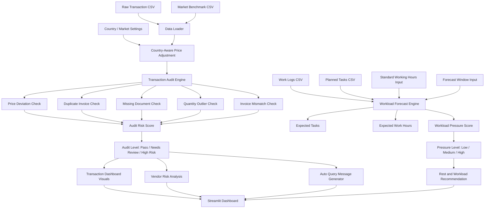

# AI-Powered Transaction Audit & Workforce Forecasting Dashboard

A practical **Streamlit-based business analytics dashboard** that combines two real-world decision-support systems in one project:

1. **Country-Aware Transaction / Bill Audit**  
   Detects risky bills or transactions by comparing submitted prices with country-adjusted market benchmarks.

2. **Workforce Workload Forecasting**  
   Forecasts upcoming employee workload pressure using operational work data such as assigned tasks, backlog, urgent tasks, work hours, task complexity, and rest hours.

This project demonstrates hands-on skills in **Python, Streamlit, data analytics, risk scoring, business intelligence, forecasting logic, automation, and responsible AI/data ethics**.

---

## Project Objective

Organizations often face two operational challenges:

- Bills or transactions may be submitted with prices that are higher than normal market expectations.
- Employees may receive uneven workloads, urgent tasks, backlog pressure, or overtime risk without early visibility.

This dashboard helps solve both problems by providing:

- A country-aware transaction audit system.
- Automated risk scoring for bills.
- Vendor-level risk analysis.
- Auto-generated query messages for flagged transactions.
- Employee workload forecasting for the upcoming work period.
- Ethical workload pressure estimation without surveillance.

---

## Dashboard Preview

### Executive Overview

The executive overview gives a quick management-level summary of total transactions, flagged transactions, possible overbilling, high workload employees, selected market, daily working hours, forecast window, audit risk distribution, and workload pressure.


---

### Transaction / Bill Audit

The transaction audit page compares submitted unit prices with expected country-adjusted benchmark prices. It flags suspicious entries based on price deviation, duplicate invoice possibility, missing documents, unusual quantity, and invoice total mismatch.


---

### Top Risk Items

This section highlights the highest-risk transactions so reviewers can quickly identify which bills need attention first.


---

### Vendor Risk Analysis

The vendor risk page summarizes risk at vendor level. It helps identify vendors with higher average risk scores, more flagged transactions, possible overbilling, or duplicate cases.


---

### Workload Forecast

The workload forecast module estimates upcoming employee workload pressure for the selected forecast window. The default view is a 7-day forecast, but the user can change the forecast period from the sidebar.


---

### Auto-Generated Query Messages

For flagged transactions, the dashboard automatically generates a professional query message that can be sent to the transaction builder before approval.


---

### Data Schema, Deployment & Ethics Notes

The dashboard includes a dedicated page explaining input data requirements, country settings, project limitations, responsible data-use boundaries, and future upgrade ideas.


---

## Key Features

### 1. Country-Aware Transaction Audit

A transaction that looks expensive in one country may be normal in another country because of currency, tax, transport cost, import cost, and local market conditions.

This dashboard includes a country/market selector so the audit comparison becomes fairer and more realistic.

Built-in country options:

- Bangladesh
- India
- United States
- United Kingdom
- United Arab Emirates
- Singapore
- Other / Custom

The dashboard can adjust:

- Currency code
- Currency symbol
- BDT conversion rate
- Local market multiplier
- Extra landed cost percentage

Bangladesh is used as the default market.

---

### 2. Transaction Risk Detection

The audit engine checks each transaction using multiple risk signals:

- High submitted price compared to benchmark
- Price deviation percentage
- Possible overbilling amount
- Possible duplicate invoice
- Missing or incomplete supporting documents
- Quantity outlier
- Invoice total mismatch
- Missing benchmark source

Each transaction receives an **audit risk score from 0 to 100**.

| Audit Risk Score | Audit Level |
|---|---|
| Below 45 | Pass |
| 45 to 69.9 | Needs Review |
| 70 and above | High Risk |

---

### 3. Auto-Generated Query Message

For every flagged transaction, the system automatically generates a query message for the transaction creator or builder.

The message includes:

- Transaction ID
- Item name
- Audit level
- Audit risk score
- Reason for flagging
- Price deviation explanation
- Missing document warning
- Duplicate invoice warning
- Request for 2–3 vendor quotations
- Request for price justification
- Request for corrected supporting documents

This makes the audit workflow faster, more consistent, and easier for reviewers.

---

### 4. Vendor Risk Analysis

The dashboard also aggregates risk by vendor.

Vendor risk analysis includes:

- Number of transactions
- Average audit risk score
- Flagged transaction count
- Estimated overbilling amount
- Duplicate case count

This helps management identify which vendors may require additional review or negotiation.

---

### 5. Workforce Workload Forecasting

The workforce module estimates future workload pressure using operational work data only.

It uses:

- Tasks assigned
- Tasks completed
- Current backlog
- Hours worked
- Urgent tasks
- Average task complexity
- Rest hours
- Planned upcoming tasks

The user can control:

- Standard working hours per day
- Forecast window from 3 to 14 days

Default forecast window: **7 days**

---

### 6. Workload Pressure Score

The workload pressure score is calculated using a weighted scoring method:

```text
Workload Pressure Score =
(Task Load × 0.30)
+ (Urgency × 0.22)
+ (Overtime × 0.20)
+ (Backlog × 0.14)
+ (Complexity × 0.09)
+ (Rest Deficit × 0.05)
```

Pressure levels:

| Score Range | Pressure Level |
|---|---|
| 0 to 44.9 | Low |
| 45 to 69.9 | Medium |
| 70 to 100 | High |

The dashboard recommends actions such as:

- Assign backup support.
- Redistribute urgent work.
- Avoid adding urgent tasks without removing lower-priority work.
- Plan additional rest hours when the forecasted load is high.

---

## Full Project Pipeline



---

## Transaction Audit Logic

### Step 1: Load Transaction Data

Required transaction columns:

```text
transaction_id, submitted_date, builder_name, builder_email, department, vendor,
item_name, quantity, unit_price_bdt, invoice_total_bdt, document_status
```

The system also supports selected-market local currency columns:

```text
unit_price_local, invoice_total_local
```

---

### Step 2: Load Market Benchmark Data

Required benchmark columns:

```text
item_name, global_market_price_bdt, local_market_price_bdt,
tax_transport_margin_pct, allowed_deviation_pct, benchmark_source
```

---

### Step 3: Apply Country-Aware Price Adjustment

For Bangladesh:

```text
expected_unit_price_bdt =
local_market_price_bdt × (1 + tax_transport_margin_pct / 100)
```

For another selected country:

```text
country_adjusted_base_bdt =
local_market_price_bdt × local_market_multiplier
```

```text
expected_unit_price_bdt =
country_adjusted_base_bdt ×
(1 + (tax_transport_margin_pct + extra_landed_cost_pct) / 100)
```

---

### Step 4: Calculate Price Deviation

```text
price_deviation_pct =
(submitted_unit_price_bdt - expected_unit_price_bdt)
÷ expected_unit_price_bdt × 100
```

---

### Step 5: Estimate Possible Overbilling

If the submitted price is above the allowed deviation threshold, the system estimates possible overbilling:

```text
estimated_overbilling =
(submitted_unit_price - expected_unit_price) × quantity
```

---

### Step 6: Calculate Audit Risk Score

The final risk score is generated from:

- Price risk
- Duplicate risk
- Document risk
- Quantity risk
- Invoice mismatch risk
- Benchmark missing risk

The final score is capped at 100.

---

### Step 7: Generate Query Message

If the audit level is `Needs Review` or `High Risk`, the dashboard automatically creates a message asking for proper market survey, vendor quotations, price justification, and corrected documents.

---

## Workload Forecast Logic

### Step 1: Load Work Logs

Required work log columns:

```text
date, employee_id, employee_name, department, tasks_assigned,
tasks_completed, backlog, hours_worked, urgent_tasks,
avg_complexity, rest_hours
```

---

### Step 2: Load Planned Tasks

Required planned task columns:

```text
due_date, employee_id, employee_name, department,
planned_tasks, planned_complexity, urgent_flag
```

---

### Step 3: Aggregate Recent Work Data

The system calculates employee-level recent averages:

- Recent daily assigned tasks
- Recent daily completed tasks
- Current backlog
- Recent daily work hours
- Recent daily urgent tasks
- Recent task complexity
- Recent daily rest hours

---

### Step 4: Forecast Upcoming Workload

The dashboard estimates:

- Expected tasks for the selected forecast window
- Expected work hours
- Workload pressure score
- Pressure level
- Suggested additional rest hours
- Recommendation for each employee

---

### Step 5: Visualize Employee Pressure

The dashboard includes:

- Employee-wise pressure score bar chart
- Expected hours vs tasks scatter plot
- High / Medium / Low pressure classification
- Employee-wise workload recommendation table

---

## Project Structure

```text
audit_workforce_dashboard/
├── app.py
├── requirements.txt
├── README.md
├── PROJECT_BRIEF.md
├── Audit_Workforce_Dashboard_Colab.ipynb
├── data/
│   ├── transactions.csv
│   ├── market_benchmarks.csv
│   ├── work_logs.csv
│   ├── planned_tasks.csv
│   ├── audited_transactions_demo.csv
│   └── workload_forecast_demo.csv
├── images/
│   ├── 1.jpeg
│   ├── 2.jpeg
│   ├── 3.jpeg
│   ├── 4.jpeg
│   ├── 5.jpeg
│   ├── 6.jpeg
│   ├── 7.jpeg
│   ├── 8.jpeg
│   ├── 9.jpeg
│   ├── 10.jpeg
│   ├── 11.jpeg
│   ├── 12.jpeg
│   └── 13.jpeg
├── scripts/
│   └── generate_sample_data.py
└── src/
    ├── __init__.py
    ├── audit_engine.py
    ├── country_config.py
    ├── data_loader.py
    └── workload_engine.py
```

---

## Technology Stack

| Area | Tools |
|---|---|
| Programming Language | Python |
| Dashboard Framework | Streamlit |
| Data Processing | Pandas, NumPy |
| Visualization | Plotly |
| Risk Scoring | Rule-based analytical scoring |
| Forecasting | Historical + planned workload estimation |
| Deployment/Test | Google Colab, TryCloudflare |
| Data Format | CSV |

---

## Installation and Local Run

### 1. Clone the Repository

```bash
git clone https://github.com/your-username/audit-workforce-dashboard.git
cd audit-workforce-dashboard
```

Or download the ZIP file and extract it.

---

### 2. Create a Virtual Environment

```bash
python -m venv .venv
```

---

### 3. Activate the Virtual Environment

Windows:

```bash
.venv\Scripts\activate
```

macOS/Linux:

```bash
source .venv/bin/activate
```

---

### 4. Install Required Packages

```bash
pip install -r requirements.txt
```

---

### 5. Run the Dashboard

```bash
streamlit run app.py
```

---

## Run in Google Colab

This project includes a Colab-compatible notebook.

### Option A: Use the Included Notebook

1. Upload `Audit_Workforce_Dashboard_Colab.ipynb` to Google Colab.
2. Upload the full project ZIP when the notebook asks for it.
3. Run all cells.
4. Open the generated Streamlit dashboard link.

---

### Option B: Manual Colab Commands

Upload the project ZIP first, then run:

```python
from google.colab import files
uploaded = files.upload()
zip_name = next(iter(uploaded.keys()))
```

```python
import zipfile, os, shutil

extract_dir = "/content/audit_dashboard_project"
shutil.rmtree(extract_dir, ignore_errors=True)
os.makedirs(extract_dir, exist_ok=True)

with zipfile.ZipFile(zip_name, "r") as z:
    z.extractall(extract_dir)

for root, dirs, files_ in os.walk(extract_dir):
    if "app.py" in files_ and "requirements.txt" in files_:
        project_dir = root
        break

print("Project folder:", project_dir)
```

```python
%cd $project_dir
!pip -q install -r requirements.txt
```

```python
!streamlit run app.py --server.port 8501 --server.headless true > streamlit.log 2>&1 &
from google.colab import output
output.serve_kernel_port_as_window(8501)
```

---

## Input Data Schemas

### Transaction Data

```csv
transaction_id,submitted_date,builder_name,builder_email,department,vendor,item_name,quantity,unit_price_bdt,invoice_total_bdt,document_status
```

Example:

```csv
TX-1018,2026-06-10,Rahim Ahmed,rahim@example.com,Operations,Eastern Supplies,Printer Toner,2,7267.22,14534.44,Incomplete invoice
```

---

### Market Benchmark Data

```csv
item_name,global_market_price_bdt,local_market_price_bdt,tax_transport_margin_pct,allowed_deviation_pct,benchmark_source
```

Example:

```csv
Printer Toner,4200,4500,4,15,Office supplies benchmark
```

---

### Work Logs

```csv
date,employee_id,employee_name,department,tasks_assigned,tasks_completed,backlog,hours_worked,urgent_tasks,avg_complexity,rest_hours
```

---

### Planned Tasks

```csv
due_date,employee_id,employee_name,department,planned_tasks,planned_complexity,urgent_flag
```

---

## Dashboard Pages

### 1. Executive Overview

A management-level overview showing:

- Total transactions
- Flagged transactions
- Possible overbilling
- High workload employees
- Selected market
- Standard working hours
- Forecast window
- Audit risk distribution
- Workload pressure overview

---

### 2. Transaction Audit

A detailed transaction-level audit page showing:

- Audited transaction table
- Risk-level filter
- Flagged transaction count
- High-risk transaction count
- Estimated overbilling
- Price deviation chart
- Download button for audited transactions

---

### 3. Vendor Risk

A vendor-level analysis page showing:

- Vendor name
- Transaction count
- Average risk score
- Flagged count
- Estimated overbilling
- Duplicate cases
- Vendor risk visualization

---

### 4. Workload Forecast

An employee workload forecasting page showing:

- Employee count
- High-pressure employee count
- Expected tasks
- Suggested rest hours
- Employee-level forecast table
- Pressure score chart
- Expected hours vs tasks chart

---

### 5. Query Messages

A message generation page showing:

- Flagged transaction selector
- Message preview
- Flagged transaction details
- Suggested action

---

### 6. Data & Ethics Notes

A documentation page showing:

- Required transaction data
- Required benchmark data
- Required workload data
- Country / market settings
- Important limitations
- Responsible data-use rules
- Future upgrade ideas

---

## Responsible AI and Data Ethics

This project is designed for **decision support**, not employee surveillance.

The workload module does **not** diagnose mental health. It only estimates workload pressure from operational work data.

The system does not collect:

- Private messages
- Keystrokes
- Webcam data
- Screenshots
- Personal health records
- Medical labels
- Mental-health labels

The goal is to support:

- Fair workload balancing
- Better resource planning
- Transparent audit review
- Data-driven decision-making

Employees should know what data is being used and why.

---

## Important Limitations

This is an MVP demonstration project.

Current limitations:

- Uses sample data.
- Demo FX values are placeholders.
- Does not use live market APIs yet.
- Does not connect to ERP/accounting systems yet.
- Audit flags are decision-support signals, not final fraud proof.
- Final approval should remain with a human reviewer.
- Workload pressure score is not a medical or psychological diagnosis.

---

## Suggested Future Improvements

Possible future upgrades:

- Connect to ERP or accounting database.
- Add live FX rate API.
- Add live market benchmark API.
- Add role-based access control.
- Add email, Slack, or Microsoft Teams integration.
- Store query response history.
- Add reviewer approval workflow.
- Add audit trail for reviewer actions.
- Train a supervised fraud/risk model after collecting enough reviewed cases.
- Add department-wise workload optimization.
- Add vendor performance history.
- Add exportable PDF audit reports.

---

## Why This Project Is Valuable

This project solves two real business problems:

### 1. Financial Control

Organizations need a faster and more consistent way to check whether submitted bills are reasonable before approval.

### 2. Workforce Planning

Managers need early visibility into upcoming workload pressure so they can distribute tasks more fairly and avoid overload.

This dashboard combines both needs into one responsible, explainable, and business-friendly analytics system.

---

## Skills Demonstrated

This project demonstrates:

- Python programming
- Streamlit dashboard development
- Data preprocessing
- CSV-based data pipeline
- Business intelligence dashboard design
- Rule-based anomaly detection
- Risk scoring
- Country-aware price benchmarking
- Vendor risk analysis
- Workload forecasting
- Plotly visualization
- Data ethics and privacy-aware design
- Google Colab deployment
- Recruiter-ready technical documentation

---

## Author

**Farhana Najnin**  
AI, Machine Learning, Data Analytics, and Research Enthusiast

- GitHub: `https://github.com/Farhana-Najnin`
- Portfolio: `https://farhana-najnin.github.io`

---

## Final Note

This dashboard is not a final enterprise fraud detection or employee monitoring system. It is a practical MVP that shows how transaction audit automation and workload forecasting can be combined into one responsible, explainable, and business-friendly analytics dashboard.
